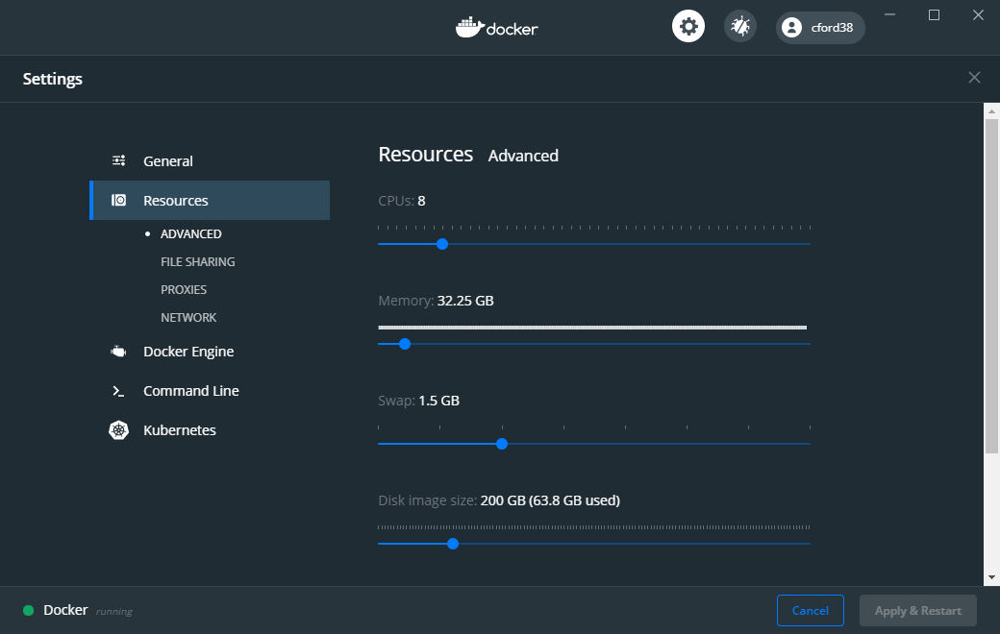

# Docker Image for HaplotypR
[](https://microbadger.com/images/cford38/haplotypr "Get your own image badge on microbadger.com")


<h4 align = "right">Colby T. Ford, Ph.D.</h4>
This repository contains the Dockerfile for generating an Ubuntu image with HaplotypR pre-installed.

## DockerHub
This container image is available from DockerHub: [hub.docker.com/r/cford38/haplotypr](https://hub.docker.com/r/cford38/haplotypr)

#### Pull Image to Local Machine
```
docker pull cford38/haplotypr:latest
```
#### To Run Locally
```
docker run --name haploytypr --rm -p 8787:8787 cford38/haplotypr
#docker exec -it haplotypr /bin/bash
```

#### Copy File to Container
```
docker cp myfile.txt haplotypr:./myfile.txt
```

### Copy Files from Container
```
docker cp haplotypr:./root/haplotypr/ ./
```

-------------------------------

## Build Instructions
1. Clone this repository to your local machine

2. Open terminal and navigate to the directory of this repository.

3. Run the following command. This will generate the Docker image.
```
docker build -t haplotypr .
```
_Note:_ You may have to increase the resource limits in Docker's settings as this container size (and the resources HaplotypR needs to run) will be quite large.
<p align="center"></p>


4. Once the image has been created successfully, run the container using the following command.
```
docker run --name haploytypr --rm -p 8787:8787 haplotypr
```

Then, navigate to `localhost:8787` from your web browser.

----------------------

## Push to DockerHub

```
docker image tag haplotypr <USERNAME>/haplotypr:latest
docker push <USERNAME>/haplotypr:latest
```

----------------------
## About HaplotypR

HaplotypR, developed by Anita Lerch, Ph.D. at the University of Notre Dame, is a program for analysis of Amplicon-Seq genotyping experiments. Check out her website for more details: [https://lerch-a.github.io/HaplotypR/)
